# QField
## Because data is outside

--- 

#### Open source Geoninjas
### Made in Switzerland

---
###### Linda Indra-Camathias
MSc in Geography @ Uni Bern
GIS Expert
Mountain Lover and Mother

###### Ivan Ivanov
BSc in Geography
Developer
Geographer and Outdoor Lover

###### Mario Baranzini
BSc in Computer Science
CAS in Software Engineering
Developer, Consultant, Teacher
Runner, Father, Tinkerer

---

### Part 1 
- About QField (presentation)
- Configuration in QGIS (exercise / demo)
- QField Cloud (demo)
- Working with QField (demo)

---

### Part 2 
- Let's play (exercise)
- Synchronisation (demo / exercise)
- More QField Features (demo)
- Conclusion and Questions

  
---

##### Capybara
##### 500k+ downloads
##### 178k+ monthly users

---

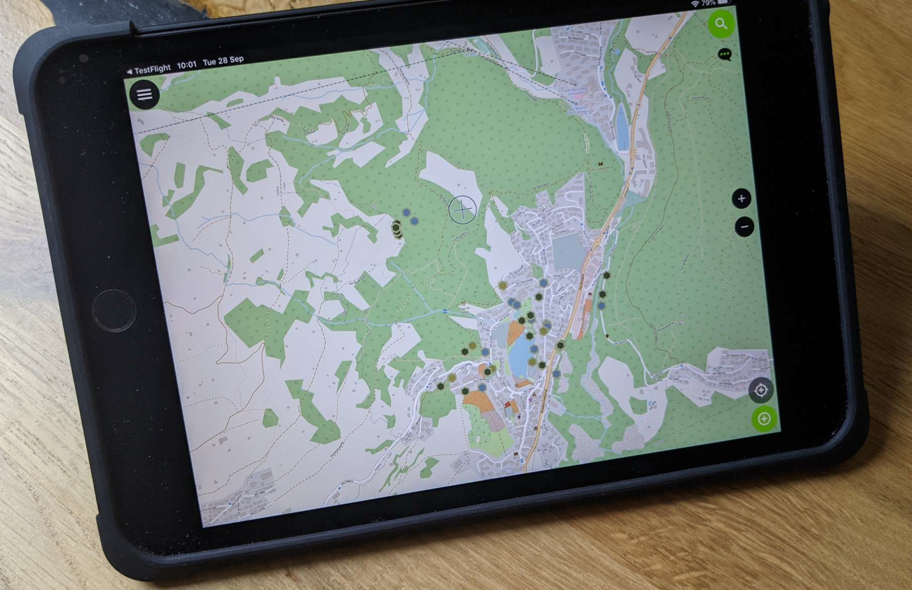

##### QField on Android
##### > Google Playstore

--- 
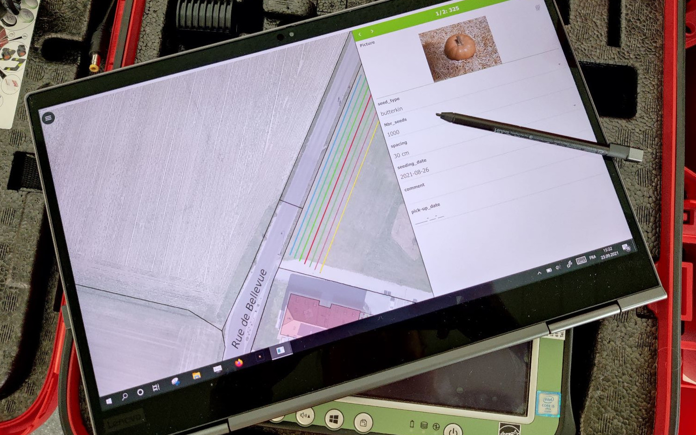

##### QField on Windows

---

##### QField on iOS

---

##### qfield.org/get

---

##### https://qfield.cloud

##### Register now!

---

## Why
# QField ?

---

## Because
# data is outside
## the office

---

## What is
# QField ?

---

### The mobile data collection app for QGIS

---

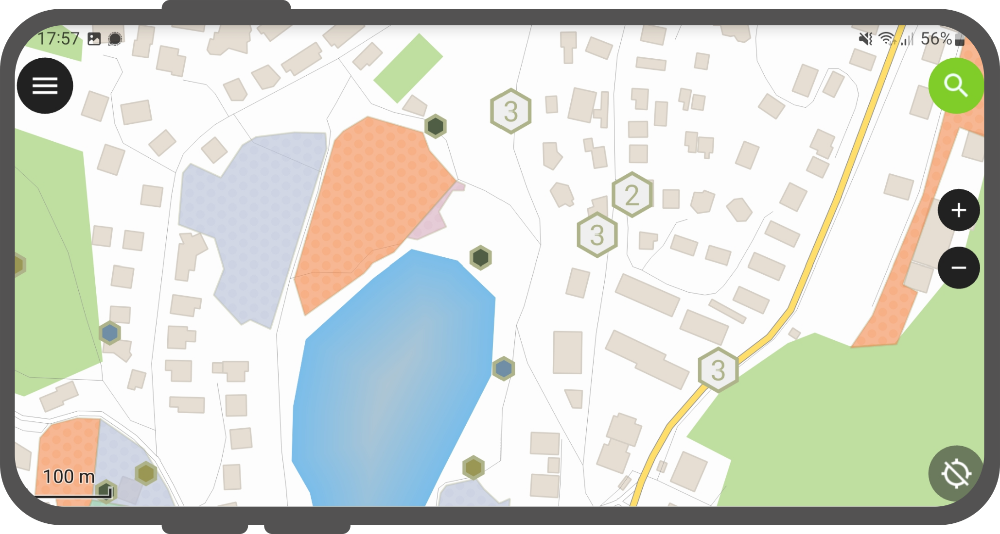

##### Minimalist UI

---

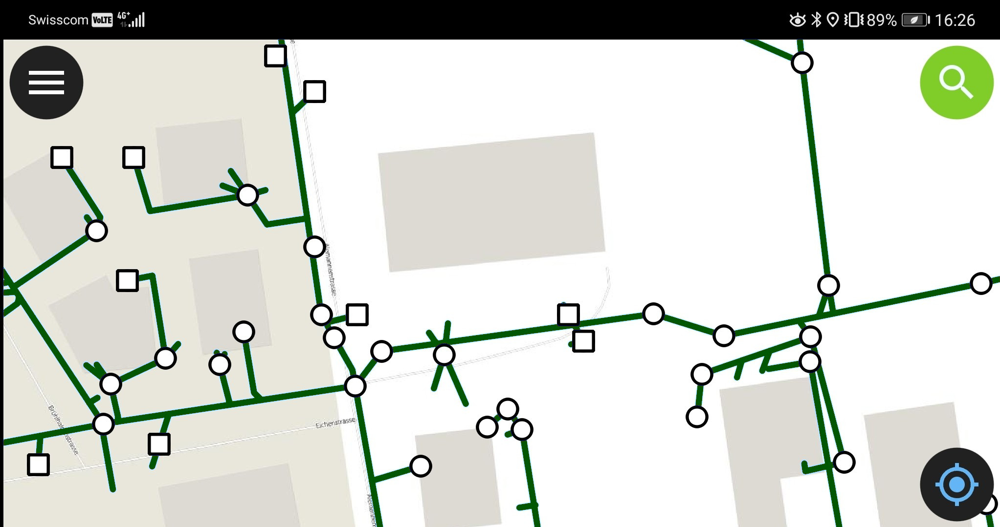

##### Beautiful cartography

---

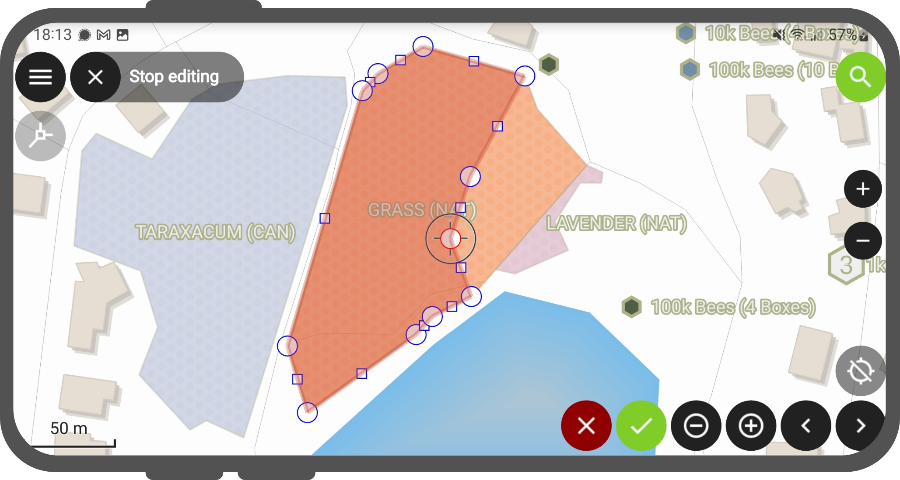

##### Powerful tools

---

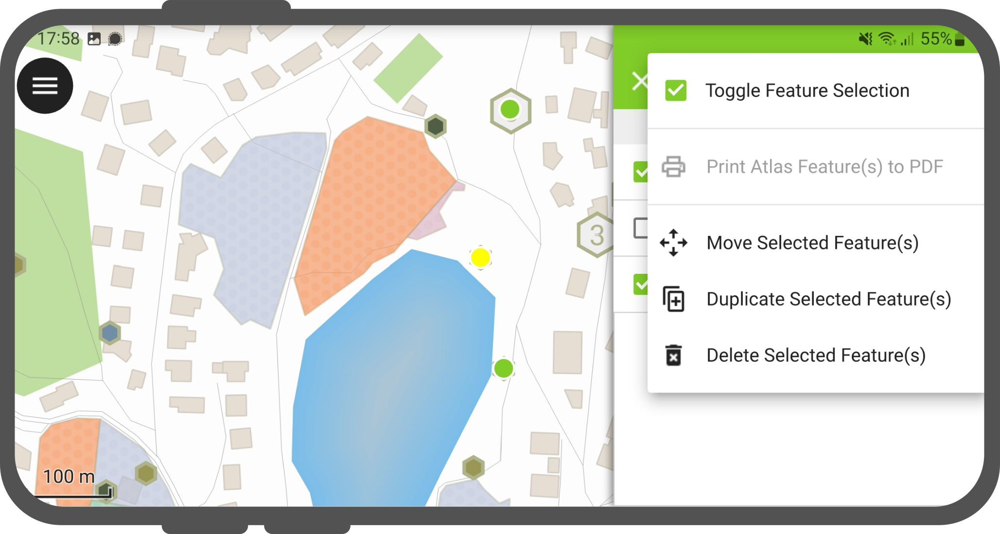

##### Efficient interaction

---

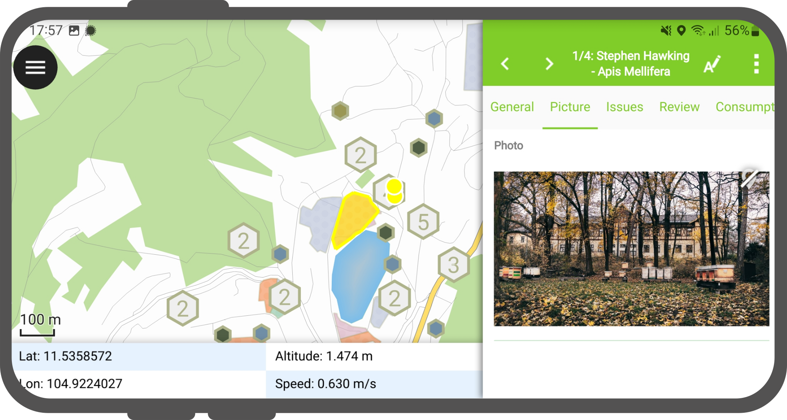

##### Beneficial integrations

---

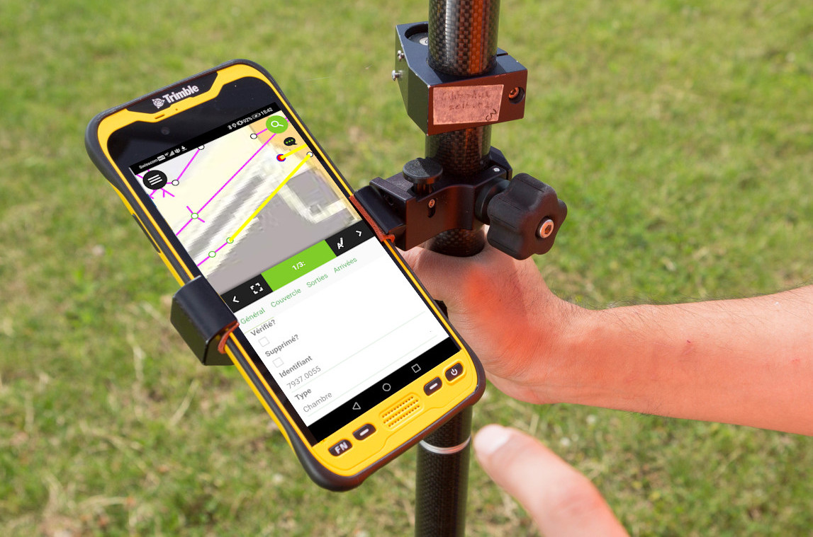

##### Professional hardware

---

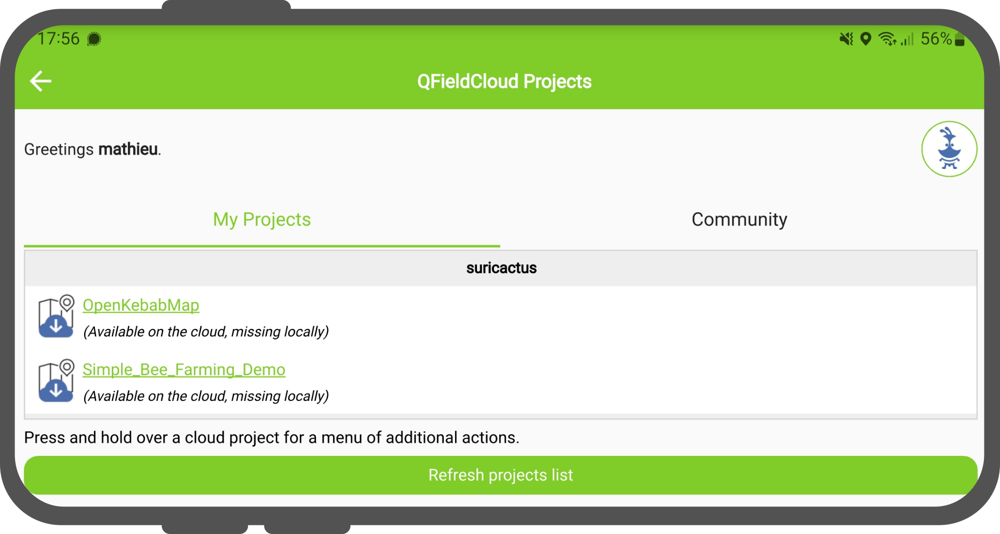

##### QFieldCloud

---

## How to work with
# QField ?

---

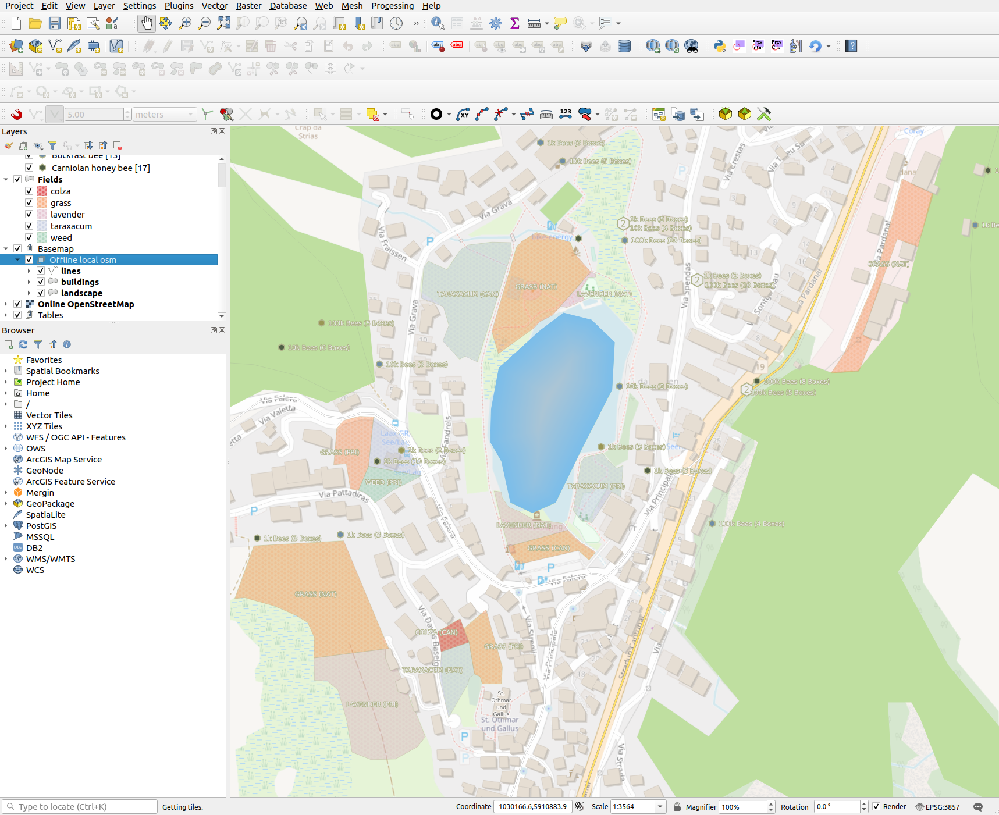

##### Comfortably prepare the work on your QGIS desktop

---

##### Efficiently work on your GIS data outdoor

---

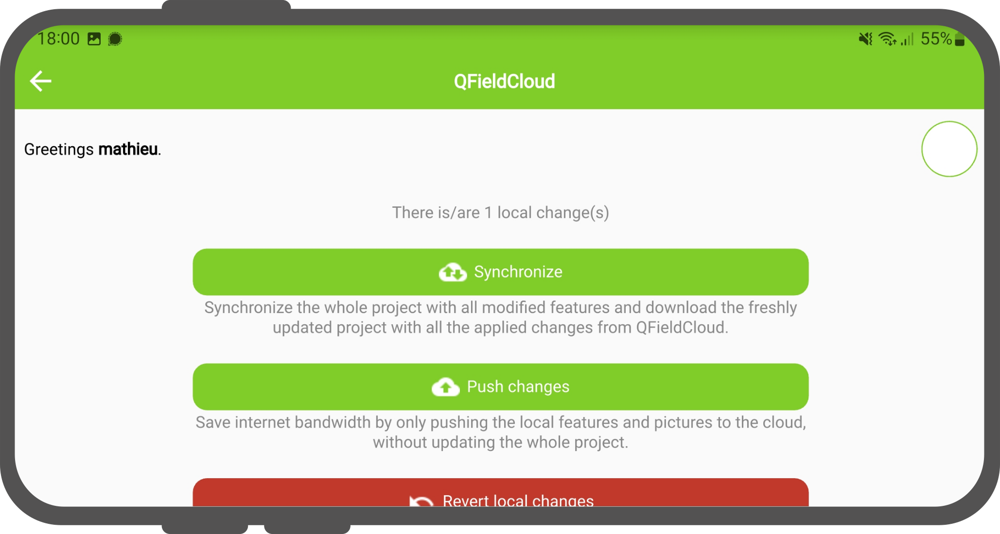

##### Seamlessly synchronise

---

## Workflows

---

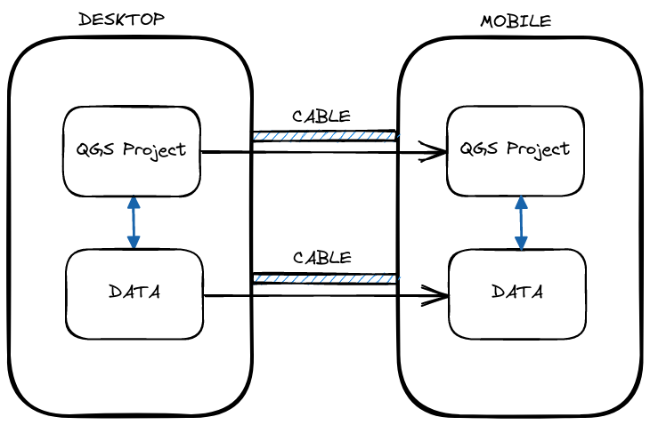
<!-- see https://excalidraw.com/#json=xudWJENNmWe8KFE0Bvykm,HUFbEvYBbMvfGwTNOjU8tw -->

### The Browser
---

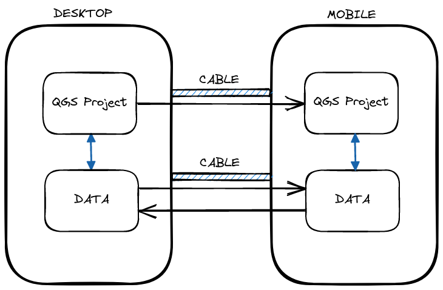
<!-- see https://excalidraw.com/#json=w_pdDlp2P1Vz4BsFVoEJf,NdgGETWi3uiy3N8dyX3jWg -->

### The Lone Ranger
---

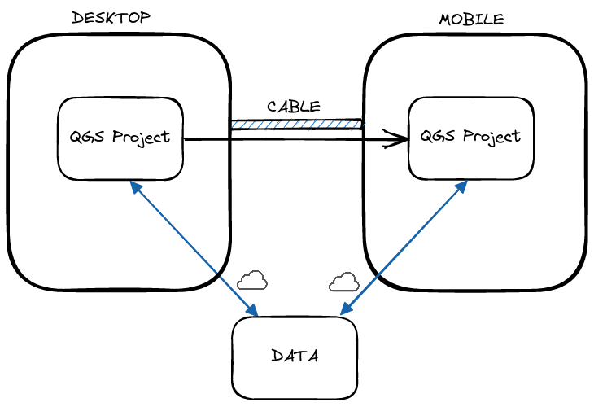
<!-- see https://excalidraw.com/#json=A7R83LWIWjlKURIbxhcA5,oRLFmvm84KFV2jxd_sHqHQ -->

### Multi-User Online
---

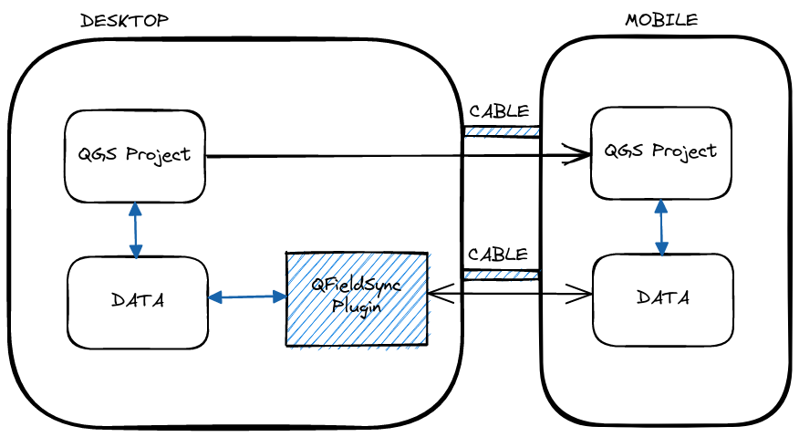
<!-- see https://excalidraw.com/#json=FpIfkDHzrmcjlzovTTQCP,W7avUQwemNmjxdGn-UoHxw -->

### Multi-User Offline
---

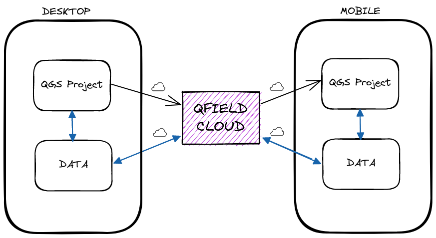
<!-- see https://excalidraw.com/#json=UAkpuk9ThyS0gdEOLZ0OJ,_0nMGZRUCRHCk63wQH3ndw -->

### QFieldCloud

---

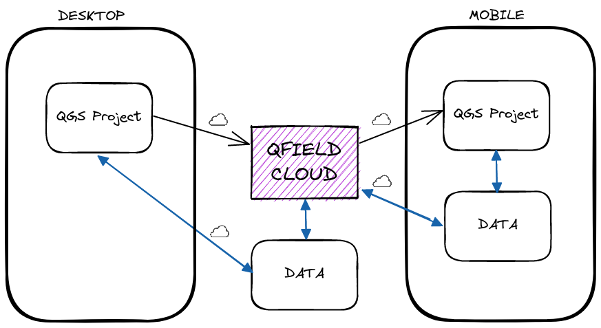
<!-- see https://excalidraw.com/#json=UAkpuk9ThyS0gdEOLZ0OJ,_0nMGZRUCRHCk63wQH3ndw -->

### QFieldCloud with DB

---
### So let's Cloud!

#### With Teams, roles and conflict management
---

## QField Feature Frenzy
---

### Live Demo
---

### [Freihandzeichnen](https://qfield.org/docs/fieldwork/digitize.html#freehand-digitizing) 🎥

---

### [Line tracking](https://qfield.org/docs/fieldwork/track_lines_polygons.html?highlight=tracking#track-lines-and-polygons) 🎥

---

### Thanks! Questions?
### qfield.org | qfield.cloud
### @opengisch
### info@opengis.ch
